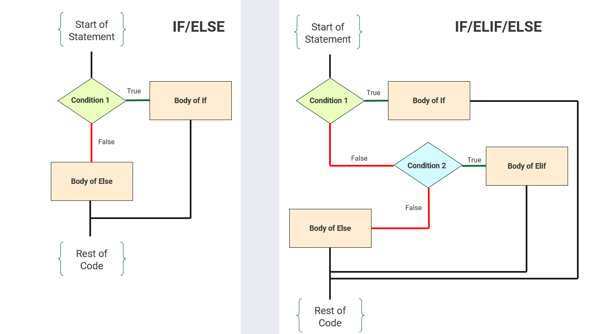

# Intro to Bash Scripting

<p align="center" width="90%">
    
</p>

Bash (Bourne-Again SHell) is a command-line interpreter, shell, and scripting language used almost ubiquitously across Unix-base and many macOS systems. Much of the function of bash is based around managing an operating system. Created by Brian Fox in around 1988, BASH has since received continuous development [throughout its history](https://developer.ibm.com/tutorials/l-linux-shells/) and to the present. 

Bash is a very helpful language to learn. It provides a very powerful and direct way to communicate with your computer without using a GUI. However, its power is also a weakness: there are no "undo" buttons when moving, removing, copying, or otherwise manipulating files or data. It is also ***not*** a good "general purpose" language - it lacks advanced data structures, has primitive error handling, and its use cases are very limited. Always write bash scripts with this in mind. This guide will definitely not cover *everything*, as that is impossible to do in a single, small-scale exercise. If you are interested further in more complicated bash topics, the greatest place to start is [the official bash documentation](https://www.gnu.org/savannah-checkouts/gnu/bash/manual/bash.html).

It is recommended not to learn bash as your first programming "language" - rather, use it as a supplement to another language you already know. Bash (and sh) is a "command-line interpreter and shell" first and a "language" second.  


## 1. The very basics: Handling and printing output

The best place to start when learning bash is experimenting with how bash handles input and output. Not only do you learn how to print to screen, but it gives you a taste of the *power* than bash has. If you go to the ***hello*** subdirectory, you will notice a simple file titled hello.sh. To run this, simply type
```
 $ sh hello.sh
```
Note that the proper file extension for a bash script is *".sh"*. This is not strictly necessary for the script to run, but it marks the file as a *shell script*, or a script executed by the Unix/macOS/whatever shell interpreter. The file extension is moreso used so that the user or reader knows the intended use of the file. Some programmers might even use a *".bash"* extension to be more specific. 

Once you have run the script, it should print something like this to terminal:

```
Hello World!
...
...
...
...
...
Goodbye, World!
```
If you take a look at the contents of the file, you will notice it uses the "echo" command to print to the screen. This is not the only way print output - we will discuss more on this in the **String Manipulation** section. 


This is nice and all, but not very interesting. There is so much more we could be doing with this file.

Let's say, for example, we want to save this information to a file. That's easy! We can use the ">" operator to send the contents to any file(s) of our choice. **But be warned,** as this operator will *overwrite* all of the contents of any file with that name. If we try to send the output of this file to an existing file titled "**important-data-do-not-delete.txt**", then congratulations! We have just overwritten some important data. Hope you had a backup!

Now, let's actually try to send some output somewhere. As mentioned before, we can redirect the output of hello.sh by doing
```
sh hello.sh > output.txt
```
If the file output.txt did not exist before, now it does! Taking a look inside of that new file will most definitely have the output you are looking for. But say we instead want not to *overwrite* and file, but *add information to the end* of a file? We can do that to, with the concatenation ">>" operator:
```
sh hello.sh >> output.txt
```
We have just added to the end of the file. This is especially useful if you, say, need to sort and add data from multiple data files to a centralized file for easy reading. 

There is one last output-manipulation operator which is perhaps the **most important** one to know: the "|" or "pipe" operator. It allows you to take standard output *(stdout)* from one bash script/command and use it as standard input *(stdin)* for another. I like to think of it as "sending" the output from once place directly into another. For example, if we wanted to count how many words are printed to the screen when running `hello.sh`, we could "pipe" the printed output into `wc`, a command that counts words: 
```
sh hello.sh | wc -w
#Notice the -w flag. It specifics to wc to count only words and nothing else (it can count lines, bytes, characters, etc.)
```
Note that pipes can be stacked as many times as you want. You can take the output from `command1 | command2` and directly pipe it to `command3`, all in one line! `command1 | command2 | command3`. There are (obviously) more commands than just `wc`, of which we will discuss in **String Manipulation**

## 2. Variables, Parameters, and Flags

Variables in bash are quite a bit different than many other programming languages. In general, there are three primary variable types: **Scalar Variables**, **Array Variables**, and **Environment Variables**. 

### Scalar Variables

Scalar variables are what comes to mind when we think about the most basic variables, such as strings or integers. They hold only *single* values. The format to declare a scalar variable is shown below:
```
#!/bin/bash

my_string="This is a string"
my_num=3
```
Notice that *there is **no** whitespace* between the variable name and the value. This is important; with whitespace, bash would (for example) read `my_num = 3` as attempting to run a command named `my_num` with `=` and `3` as *parameters*, not assigning them as a *value* in a variable. 

This is also a good time to mention variable types. In bash all variables are generally *untyped* unless declared explicitly. In the example above, the system actually treats `my_num` as a string, not an integer. This can be especially annoying when we need to perform arithmetic on a variable. Bash also *does not* natively support floats. More on this in the **Arithmetic** section.

To reference a variable at any part in your code, use the `$` symbol in combination with a *brace* `{}` to keep the variable "encapsulated", like so: . 
```
#!/bin/bash

my_string="This is a string"
my_num=3
echo "My string is ${my_string} and my number is ${my_num}"
```
Note that encapsulation is not strictly necessary, but highly recommended. Without it, bash will attempt to read all characters past the `$` symbol (excluding spaces) as the name of the variable. So if you do not have whitespace between where you are trying to print the variable and the next part of the string, it will fail.
```
echo "$my_string123"  #Results in an error, as the variable is not findable. 
echo "$my_string 123"  #Echoes "my_string 123" to screen (with whitespace)
echo "${my_string}123"  #Echoes "my_string123" to screen
```


You can also "declare" a variable to be a specific type using the `declare --flag` operation, if you wish to fully type your variables. I will not go into fine detail with variable declaration for scalar variables, but if you wish to know more then [this page](https://tldp.org/LDP/abs/html/untyped.html) from **The Linux Documentation Project** has a great exploration of this topic.

|Flag| Description of flag operation |
|----|---------------------------------------------------------------------------------------------------|
| -i | Declare as an integer. Arithmetic expressions inherently handled and evaluated.|
| -a | Declare as an indexed array. This is assumed if not declared. More on this in **Array Variables** |
| -A | Declare as an associative array. More on this in **Array Variables**|
| -r | Declare as read-only, meaning its value cannot be changed.|
| -x | Mark a variable for export to the environment. More on this in **Environment Variables**|
| -p | Print the attributes and value of each variable. Useful for checking variable types|

### Array Variables

In addition to typical scalar variables, bash can also handle 1-dimensional arrays. Since everything including arrays are technically untyped (unless they are declared beforehand), an "array" in bash can feature both strings *and* integers. While one could definitely argue that this would fail the strict definition of an array (I personally would not disagree), remember: **everything is untyped to begin with**. Those "integers" in the array are really just strings.

Arrays as variables are typically declared using the following format:
```
my_array=(data1 data2 data3 data4)  #Space between data points instead of commas, using paranthesis instead of closed brackets.
```
If not explicitly declared using a `declare` operator (like in the example above), bash assume the array is an indexed array. Much like other languages, indexing in bash starts from 0 and goes to N-1 (with N being the length of your array). Unlike other languages, you don't need to specify the array size to add things through indexing. To add an item at index 2, simply write `my_array[n]=<item>`. To delete an item, use `unset my_array[n]`
```
#!/bin/bash

desserts=("cookies" "cake" "brownies")
echo "${desserts[*]}"  #caookies cake brownies
desserts[3]="ice_cream" #Adds item "ice_cream" into slot 3. Since slot does not exist, it creates the new slot
echo "${desserts[*]}" #cookies cake brownies ice_cream
unset desserts[0] #Removes item in slot 0, "cookies", from array.
echo "${desserts[*]}" #cake brownies ice_cream
desserts[0]="popsicles"  #Adds "popsicles" into that slot 0 null character.
echo "${desserts[*]}" #popsicles cake brownies ice_cream
```
**NOTICE**. When using unset on slot 0, all of the items to the right **DO NOT AUTOMATICALLY** shift left to fill the space. This is because bash does not *really* "destroy" the slot for that structure; rather, it sets whatever is at slot 0 to a "null" or "empty string". You can see this more clearly if you run `declare -p desserts` after having removed the 0 slot.

Below is a graph of what is *really* happening:
 

As of bash 4.0 (released in 2009), bash can also handle something called an "associative array", which is an array indexed by keys (strings) instead of numbers. For those of you who are more familiar with languages like C#, Python, or Swift, this acts almost functionally identical to a dictionary. It is also the only variable type that needs to be specifically declared:
```
#!/bin/bash

declare -A colors
colors["red"]="Hex code: FF 00 00"
colors["blue"]="Hex code: 00 00 FF"
echo ${colors["red"]}  #Output: "Hex code: FF 00 00"
```

Be warned when using associative arrays. Since bash places great emphasis on *backwards compatibility*, these arrays will **not** work on older systems. In the case that you need these kind of structures in an older system, you will need to find a way to find a work around. In addition, bash arrays are not designed to work well for large datasets - they are stored in memory, their operations get slower as the size of the array increases, and they generally don't scale well. It is best to save bash arrays for little tasks.  

### Environment Variables

Environmental variables are fundamental to the Unix/Linux operating system. This is primarily where the concept of bash being a **shell first**, and a **programming language second** - bash's ability to interact with the operating system environment. These special variables give you a lot of power, which requires a lot of care when using them. Here is a multitude of example environment variables. 
|ENV Var| Variable description|
|---------|------------------------------------------------------------|
| $USER   | Gives username of the current user (you, I hope)           |
| $HOME   | Gives filepath to your home directory                      |
| $PATH   | Gives your command searchpath                              |
| $SHELL  | Gives the location of your shell                           |
| $PWD    | Gives the current working directory you are in             |
| $EDITOR | Gives information on the default file editor for the shell |
| $LANG   | Gives the default system language                          |
| $UID    | Gives the user's user ID (hopefully that's you!)

If you are running this training in Odo, or Frontier, or whatever system that is not your own, I would **be very careful** when messing with these. But it is useful in bash scripting to be able to get information such as your current path, user, etc. If you wish to learn more about creating your own environment variables, [look here](https://www.geeksforgeeks.org/linux-unix/environment-variables-in-linux-unix/).

### Special Variables

If you have been paying attention to the last few code snippets, you might have noticed that each has begun with the line `#!/bin/bash`. This is not a comment, but something called a *shebang* line. The `#!` at the beginning indicates to the shell that the following path (in this case, `/bin/bash`) leads to the interpreter *from which the code is executed*. This is **not** always necessary; explicitly calling bash to run the script `bash script.sh` can render the shebang unneeded. However, it is **highly recommended** to include this at the start of *each and every bash script you write*.   

There are also special variables that allow you to send *arguments*. This is great for a good number of reasons, from creating *option flags* for your scripts to *sending specific files* that you want the script to interact with. Below is a list of a few of these special variables:

| Special Var. | Action |
|----------------|-----------------------------------------------------------------------------------------|
| $0             | References the name of the script                                                       |
| $1, $2, .., $N | References the parameters up to N after the script, $1 being the first after the script |
| $#             | References the number of parameters sent                                                |
| $@             | Gets all parameters as separate strings                                                 |
| $*             | Gets all parameters as a singular, combined string                                      |
| $?             | Gets the exit status of the last executed command                                       |
| $$             | Gets the PID (Process ID) of the current script / shell                                 |
| $!             | Gets the PID of the last-executed background command                                    |

The last three are especially useful for debugging. If you wish to see an example of how filenames can be sent as arguments, do the following:

```
$ cd variables  #Make sure you are in the variables subdirectory for this
$ sh arguments.sh <file-you-want-read>.txt  #The filename is sent as $1
```

I would highly advise you make and mess around with your own variables to get the hang of it. The best way to learn bash **by far** is to practice using it. Writing custom flags for your bash scripts is tricky, but can be done with parameters. You can find more on how to do that [here](https://linuxconfig.org/bash-script-flags-usage-with-arguments-examples) (Requires knowing while-loops). 

### Reading User Input

The last subtopic of variables has to do with reading and handling input. You can achieve this by using the `read` command in the follow syntax: `read <input_storage>`. As with everything else in bash, input is fundamentally treated like a string unless previously declared or you try to do arithmetic on it.

```
read inp1  #Basic form of reading input
read -p "Enter input: " inp2  #You can send the -p flag to print a "prompt" to screen for input

read -p "Enter 3 items seperated by a space: " l0 l1 l2 #You can have multiple inputs on one line
```

If you run this as a set bash script (located in `02-variables/read_input.sh`), you will notice that the system will "pause" to take your input. On the very first `read` command, the line will be blank since there is no prompt. This is normal behavior. In general, bash will wait **indefinitely** for user input. If you want to add a timeout function to change this, just add the `-t` flag. 

Just like how you can redirect *output* in bash, you can also redirect *input* with an operator. You can think of this as "sending" input to be read into a `read` command. The operator for doing this is `<`, with the syntax being `command < input`. Notice that the input you are sending is on the **right** and the actual command is on the **left**. Let's look at the example `02-variables/redirect_input.sh`:

```
#!/bin/bash

grep "Line" < file.txt  #Takes input from file.txt and greps for "Line".

line=$( wc < file.txt )  #You can set directed input as a variable like so.
#In this case, we are sending file.txt into command wc, which counts the size of the file.

echo $line  #This will be explained later
```

Now that you have a knack for all kinds of variables in bash, you are ready to start manipulating their values!
 
## 3. Arithmetic

Arithmetic in bash is a bit... strange. Since every variable is treated as an untyped string, we need to use a different set of operations and syntax to properly do math. It becomes especially tricky once we start to assign numbers to variables. There are a multitude of ways to go about performing mathematical operations in bash, but this guide focuses on two: `$((<op>))` syntax for integer arithmetic and the `bc` command for floating-point numbers. 

### `$((<op>))` syntax

Remember earlier in this guide that taught you how to "encapsulate" string variables to keep them clean and readable? This is why. Similar to how you would use `${}` syntax to mark a variable in a string, you can use `$(())` to mark a section as performing mathematical operations. Let's look at the example below from file arithmetic/math1.sh:
```
#!/bin/bash

#!/bin/bash

a=14
b=2
c="abc"

echo a + b   #a and b are not refrenced
#a + b
echo $a + $b   #a and b are refrenced, but not added
#14 + 2
echo "$((a + b))"  #a and b are refrenced, encapuslated in arithmetic, and computed
#16
echo "$((a * b))"
#24
echo "$(((a - b) / 2))"  #The rules of PEDMAS still apply. This is how you handle paranthesis.
#6
echo $c
#abc
echo "$((c+3))"  #Attempts to treat c as an integer. Since is is a string, the integer value it assigns is 0.
#3
```
Bash is capable of doing most basic arithmetic out there. But since it does not handle floating-points natively, **any** division result will cut off decimal-place answers. For example, `echo "$((10 / 4))"` would return `2` and drop the `.5` decimal at the end. Below is the proper syntax for all arithmetic done in this way:

| Syntax      | Effect                                               |
|-------------|------------------------------------------------------|
| $((a + b))  | Addition                                             |
| $((a - b))  | Subtraction                                          |
| $(a * b)    | Multiplication                                       |
| $((a / b))  | Division                                             |
| $((a ** b)  | Exponential                                          |
| $((a % b)) | Modulo Division                                      |
| a=$((a += b)) | Incrementation by constant|
| a=$((a -= b)) | Decrementation by constant|
| a=$((a *= b)) | Multiply by constant|
| a=$((a /= b)) | Divide by constant|
| a=$((a %= b) | Modulo by constant|

Of course, this is not the only way to do integer arithmetic in bash. Using the `let` or `expr` commands is valid depending on their context. But I am focusing on this form because it is generally the preferred and most efficient method in most use-cases. You are free to use whatever your project might call for. 

### `bc` command

For handling actual floating-point numbers and more complicated math, you can use the `bc` library. It is important to note that `bc` (or basic calculator, as it is called) is **not** a built-in part of the bash shell; rather, it is a separate command-line utility written in C (as all good things are) that comes pre-packaged in most, *but not all*, Linux distributions. Depending on what version of Linux/macOS version you are running, you might have to install it manually to use it. **This is because native bash has *no* handling of floating-points.**

Because it is not a built-in package, you actually have to *pipe* your mathematical equation to the `bc` operator. 
```
#!/bin/bash

a=10
b=3
c=2.3

echo "scale=2; $a / $b" | bc  #MUST use the referal of variables with $ to refer to their values here. Notice the | pipe operator.
#3.33
echo "scale=3; $a / $b" | bc  #More accuracy than previous
#3.333
echo "scale=1; $a + $c" | bc  #Will read $c as a float
#12.3

echo "scale=4; s(1.571)" | bc -l  #Sine of ~(pi / 2)
#1.0000
echo "scale=4; l(e(2))" | bc -l  #Natural log of e^2
#1.9999


echo "scale=3; ($a / $b) + $c" | bc  #Example of compound equation with floats
#5.633
```
The `-l` flag calls for the **bc library**, which has all kinds of basic math from trigonometry to natural logs. *But remember*, bc is NOT a part of bash and thereby may NOT have the same backwards-compatibility typically found in bash scripts. More on what the bc -l package can do can be found [here](https://www.geeksforgeeks.org/linux-unix/bc-command-linux-examples/).

## 4. Comparisons


Given the long evolutionary history of bash as a shell that has evolved greatly over time, there are technically three primary syntaxes for comparing values, being single-brackets `[]`, double brackets `[[]]`, and double parentheses `(())`. While each can be used for different things, we will primarily be focusing on double-bracket syntax as it is the newest and most robust. In general, the format for comparisons is `[[ <item1> -<compare operator> <item2> ]]`. **Notice** the spaces that separate each argument; *these are important for how bash interprets the comparison*. 

Below are the many comparisons bash is capable of doing:

| Operator | Description                    | Example                |
|----------|--------------------------------|------------------------|
| `-eq`    | Equal to                       | `[[ $a -eq $b ]]`     |
| `-ne`    | Not equal to                  | `[[ $a -ne $b ]]`     |
| `-lt`    | Less than                     | `[[ $a -lt $b ]]`     |
| `-le`    | Less than or equal to         | `[[ $a -le $b ]]`     |
| `-gt`    | Greater than                  | `[[ $a -gt $b ]]`     |
| `-ge`    | Greater than or equal to      | `[[ $a -ge $b ]]`     |
| `&&`     | Logical AND                         | `[[ condition1 && condition2 ]]`  |
| `!`      | Logical NOT                         | `[[ ! condition ]]`                | 
| <code>&#124;&#124;</code>| Logical OR for | <code>[[ condition1 &#124;&#124; condition2 ]]</code> |

Since everything is untyped and treated as a string in bash, there is no "Boolean" variable type. Instead, we have the `true` and `false` **commands**, which return either a 0 for `true` (indicating that the command *exited successfully*) or nonzero numbers for `false` (usually 1, indicating that the success did *not exit successfully*). You can set variables equal to these commands, and they will usually function like they would in another programming language. but it's important to know this distinction when using them.

Before we get into the typical if/else, let's take a quick detour into the logical operators. These are the primary way in which comparisons can be used *without* an if/else block. An example run within the bash command line is shown below (follow along if you wish to try this yourself):

```
[[ 5 -lt 3 ]]  #Running this command on its own returns nothing, but...
echo "$?"  #Remember this special character that returns the process id of the last executed command? Now it shows us how "booleans" really work in bash!
# Output: 1 (or something that isn't 0)

[[ 15 -gt 7 ]] && echo "Success!!"  #AND comparison. Since the comparison on the right returns succesfully, and the echo command on the left also returns succesfully, the output command is actually echoed!
#Output: Success!!
#If we switched the -gt flag with the -lt flag, the AND conditional would fail and no output would happen. 
```

These use cases are typically reserved for using command-line level bash and not for scripting, but it is still good to know these. 

### If/Else and If/Elif/Else

If/Else and If/Elif statements in bash work the same as any other programming language would, with some syntax difference. Here is the main structure for both:



The main and recurring syntax for these blocks in bash is the use of **start** and **stop** indicators; for `if/else` and `if/elif/else` statements, these are `then` and `fi` (Notice that `fi` is the word `if` spelled backwards!). They indicate to the bash interpreter when the block begins and ends. You will also need to use a semicolon to place a distinction between the *start* command at the *condition / comparison*. While indentation is not strictly necessary for the `if` block, it helps with readability.

Now, let's look at `comparisons/ex1.sh`, a brief and simple number comparison example:

```
#!/bin/bash

read -p "Enter a number: " my_num  #Reads input

if [[ $my_num -gt 10 ]]; then  #Notice the ; seperating the comparison/condition from start clause "then"
        echo "Your number is greater than 10."
else
        echo "Your number is NOT greater than 10."
fi  #Ends with end clause "fi"
```

This simple bash script reads an input as a number and attempts to check its value. There is no error handling on this, so entering a non-number character will result in a syntax error followed by treating the variable my_num to as integer value 0 (as per bash integer rules).

Let's take a look at another example, this time with a few *nested* elif statements as well: 

```
#!/bin/bash

read -p "Enter a number: " n

if [[ $n -lt 3 ]]; then
        echo "My number is less than 3"
elif [[ $n -eq 4 ]]; then
        echo "My number is 4"
elif [[ $n -eq 5 ]]; then
        echo "My number is 5"
elif [[ $n -ge 6 ]]; then
        echo "My number is 6 or greater"
else
        echo "My number is 3."
fi
```

Notice how the `else` statements is for handling if the number is 3. In this case, the code will run through all of the if/elif statements until it reaches the end. This is mostly to demonstrate behavior of the if/elif/else structure. As with anything, the best way to learn these is to practice writing them yourself. 

## 5. String Manipulation 

Perhaps one of bash's strongest utilities is its ability to change, match, search, and otherwise manipulate strings. However, many of them are not super centralized and have inconsistent and sometimes confusing-to-use syntax. This section will not cover all of them - just some of the basics. Here's a few of the basics on example form:

```
#!/bin/bash

str1="Hello, World."
echo ${str1:0:5}  #Like lists, strings can be indexed, itereated, and sliced through
echo ${str1: -6}  #They can even be indexed from the end!

str2="mSD90sfmjo"
echo ${#str2}  #Gets the length of the string

str3="I dont like bash. I dont really like bash."
echo ${str3/dont/really}  #Local replacement (replaces first instance)
echo ${str3//dont/really}  #Global replacement (replaces ALL instances)

str4="Substrings are difficult."
echo ${str4%%are*}  #Cuts off all string past (and including) substring "are"
```

You may have noticed that for printing strings to screen, we have been using the `echo` command. Bash does actually have another method called `printf`, which *differs in usage*. In general, `echo` always appends a newline to the end of each print string it prints and is used mostly for simpler print tasks (as it lacks many of the robust formatters found in `printf`). On the other hand, `printf` does **not** append a newline at the end of each printed string. It leaves all forms of formatting up to the coder and is *much more robust* for formatting complicated prints. Some examples of how to use `printf` can be found [here](https://linuxconfig.org/bash-printf-syntax-basics-with-examples).  

### Case-Esac

Similar to the if/else block, bash also has a `case` statement. This is similar to a `switch` statement found in C, C++, and other compiled languages (the Python equivalent is the `match-case` statement). It is great for handling pattern-based cases for specific scenarios. Unlike the if/else block in bash, each case is separated by *two semicolons (;;)*. 

Let's take a look at this example code '05-string-manipulation/'which asks the user for a number grade and returns a letter (this is based off the American school system grading scale. Apologies if this is confusing to any readers who are not from the US.)

```
#!/bin/bash
read -p "Enter a score (0-100): " score
case $score in
        [9][0-9]|100) #) Marks the beginning of a case-output. This is what you do once case [9][0-9]|100 is reached.
                echo "Grade: A"
                ;;  #Notice the double ;; marking the end of a case-output
        [8][0-9])  #[] indicates an "or" range. More information on this in the link below in section "Pattern Matching"
                echo "Grade: B"
                ;;
        [7][0-9])
                echo "Grade: C"
                ;;  #As with all things in bash, indentation not neccesary but reccomended.
        [6][0-9])
                echo "Grade: D"
                ;;
        [0-5][0-9])
                echo "Grade: F"
                ;;
        *)
                echo "Invalid score."
                ;;
esac  #NOTICE the end identifier!!
```

It is important to note that `case` can also be used for comparisons of numbers and such. It sits here in the **String Manipulation** section as opposed to the **If/Else** because it primarily operates through string comparisons and pattern matching. 

### Pattern Matching 

Very briefly: since we have just learned about comparisons, we can apply this directly to string matching. This follows the same comparison format of `[[ <item1> -<compare operator> <item2> ]]`. 

| Operator | Description                    | Example                |
|----------|--------------------------------|------------------------|
| `!=`      | Not equal to                                | `[[ $str1 != $str2 ]]`  |
| `<`       | Lexicographically less than                 | `[[ $str1 < $str2 ]]`   |
| `>`       | Lexicographically greater than               | `[[ $str1 > $str2 ]]`   |
| `=~`      | Matches a string against a regex           | `[[ $str =~ regex ]]`   |
| `-n`      | Checks if the string is non-empty           | `[[ -n $str ]]`         |
| `-z`      | Checks if the string is empty               | `[[ -z $str ]]`         |

This is great for throwing conditional comparisons within if/else statements, such as editing output in cases where input is blank or checking for certain "markers" in a file. You can read more about the powers of grep and regex [here](https://computing.stat.berkeley.edu/tutorial-using-bash/regex.html) (I will not go into specifics because its a lot to cover). If you are doing the "password in a haystack" challenge as part of the HPC crash course, then you will get the chance to directly practice with `grep`!

## 6. Loops

Just like with if-else blocks, loops in bash require a **start** and **stop** identifier: `do` and `done` respectively. This breaks the typical bash convention of the ending being the same word as the start identifier but backwards. This is mostly to keep in-line with the convention of all other *control structures* and simply because it is very readable. This section will cover both `for` and `while` loops in bash. As a refresher, a graph demonstrating their structure is provided below. 


### For Loops

Bash `for` loops are inherently *iterative* and do not easily handle traditional *range-based* for-loops that programmers from other languages (looking at you, Python programmers!) are used to. There are a multitude of examples to explore in 06-loops, but we will focus on two: `for_loop_files.sh` and `for_loop_num.sh`. 

```
#!/bin/bash

for file in file*; do  #file* finds all files with name 'fileX' followed by whatever characters 'X' and onward.
        echo "${file} contents:"
        cat $file
        echo ""
done
```

This script finds all the files with the name "file" at the beginning and prints their contents. 

One of the strongest aspects of bash is its ability to natively interact with the file system. This is another major use-case for bash: checking through files and centralizing, manipulating, and otherwise changing files to fit your liking. You can, of course, navigate to and from different subdirectories using `cd` within your script. If you combine this with environment variables such as `$PWD` and `$USER`, the possibilities for setting and manipulating the shell are (almost) limitless. 

Earlier I mentioned that bash does not handle *range-based* for-loops particularly well. However, this does not mean bash is unable to do them; rather the syntax and style is more akin to the **C-style** loop. This is (like many things) because of bash's evolutionary history as a shell and its close relationship with the creation of C. Now, let's explore how to handle these kind of loops in `06-loops/for_loop_num.sh`:

```
#!bin/bash

read -p "Enter a number: " num

for (( i=0; i<=num; i++)); do  #C-style syntax for loops
        echo $i
done
```

### While Loops

`while` loops in bash will continuously execute the command body until the condition is no longer true (exits with a nonzero process). These are particularly useful when you don't know the size of your body-input to loop over, or you need to continuously do something repetitively (script automation!!). Lets look at the example in 06-loops/while_loop.sh

```
#!/bin/bash

items=()  #Initalizes an empty array
read -p "Enter a string, or type 'exit' to quit: " entry

while [[ "${entry}" != "exit" ]]; do
        items+=("$entry")  #adds to the array
        read -p "Enter a string, or type 'exit' to quit: " entry
done

echo "Items you have entered: "
for i in ${items[@]}; do
        echo $i
done
```
I would like to comment that, in general, adding to an empty list like this can get costly. This code was just to show a use-case for while-loops.

Bash also has what is called an `until` loop, which executes the body of the loop repeatedly **until** the condition is *met* (or exits with code 0 as true). This is the exact inverse of the `while` loop, which continues until the condition is no longer true. For example, an `until` loop with condition `until [[ x -gt 10 ]]` (x > 10) will have the same effect as a `while` loop with condition `while [[ x -le 10 ]]` (x <= 10), as both will terminate once x is greater than 10. 

In general, I would advise against using `until` loops unless a specific use-case calls for it, as they do not translate well to many programming problems (and are in many not even included at all). I will not be including a guide on how to write them, as they have the same syntax as their `while` counterpart. 

## 7. Functions

The last topic that this guide covers is functions. A function is essentially a block of code that, when called, performs a specific task. It is essentially a way to standardize the actions of your code into a readable format and are used regularly in almost every kind of programming. Bash functions have a lot of odd quirks to them that are very unusual when compared to other languages. In general, the basic syntax for a function looks like this:

```
#!/bin/bash

testFunction () {  #Notice the parentheses (). This indicates that "testFunction" refers to a function and not a variable. Also notice the brackets {}, which indicate the contents of the function.
     #Body of the function here
}

testFunction  #"Calls" the function to be run. Once to interpreter reaches this code, it will jump up to the function name and execute the body of the function.
```

### Parameters

Parameters are arguments that you send to the function so that it can do operations on them. Typically these can be anything - variables, strings, arrays, etc. - ___. Unlike other programming languages, they are **not** included as part of the function definition and call. Parameters are instead accessed using those *special variables* that we discussed earlier. You can essentially think of functions in bash more as a command with arguments after. Here is the example `07-functions/function-parameters.sh`: 

```
#!/bin/bash

myFunction () {
        echo "$1" #Special variable that gets the 1st parameter (argument) sent after the function call
        echo "$2"
        echo "$3"
        return 0  #Return value. Typically used for checking if the function executed succesfully (0) or not (nonzero). Great for comparisons.
}
myFunction "first parameter" "second parameter" "third parameter"  #Parameters are seperated by a space
echo "The return value is ${$?}"
```

Notice the use of `return` to return a value. Once again differing greatly from functions in other programming languages, `return` in bash is **never** used to return some arbitrary value that the function worked on. Instead, it is used to signify an exit code to check if the function ran properly. This is usually used in tandem with true/false comparisons to run simple logical operations. We will discuss actually get variables/values in and out of functions in the next section.

### Local and Global Variables

The variables within a bash function are **always** global variables *unless otherwise specified within the function's body*. What this means is that a variable declared inside the function is accessible *globally*, or outside of it. If you want to avoid this, you need to declare a function as local using the `local <var_name>` command BEFORE setting its "value". Let's take a look at `07-functions/function-variables.sh`: 

```
#!/bin/bash
var_predefined="Predefined global variable"
my_vars () {
        var_global="Global Variable"
        local var1
        var_local="Local Variable"
        return 0
}

echo "${var_predefined}"  #A regular function defined outside of the function scopre
echo "${var_global}"  #Since my_vars has not been called yet, var_global has not been set. echoes a NULL string

my_vars  #Function call to intialize my set variables"

echo "${var_global}"  #Since my_vars has been called, this global variable is visible.
echo "${var_local}"  #This is a local variable. Thus, the variable is unfindable here. echoes a NULL string
```

In order to get the function to actually set variables that will affect other parts of code, you need to utilize this global-variable characteristic of bash functions. **NOTE:** since they are global variables, they can be changed by *any part of your code*. You need to be careful when naming your global variables, lest you accidently overwrite something.

### Miscellaneous information on functions

A few additional notes on functions:
- Functions in bash can be *nested*. This means that you can define a function within another function.
- Make sure to only call functions **after** they have been written. If you call them before, the function won't be findable to the interpreter. 
- You can call function within the body of another function (as long as it has been defined). This is common practice in some spheres.
- If you want to know more on function and function scope, [Geeks for Geeks](https://www.geeksforgeeks.org/linux-unix/bash-scripting-functions/) has a great intro. 

## 8. Practice Challenges

### So, why do we use Bash anyway? When is it used in HPC?

Other than the obvious fact that most High Performance Computing (HPC) interfaces are entirely on bash or bash-adjacent systems, knowing basic scripting skills can really elevate your productivity. It can be used in tandem with job managers such as "Slurm" to easily and efficiently submit jobs and automate many processes, including data preparation, compilation of code, etc. 

For example: say you are attempting to find the best node-count, gpu's, walltime, etc. for a specific job type you are trying to run. You could manually test how each performs under specific parameters, **OR** you could write a bash script that comprehensively goes through each possible parameter (loop), writes the output of each job to a centralized file (output handling), and finds the best one (string/integer comparison) - all in the background, while you work on other tasks! It's really quite useful for the HPC environment.

Speaking of environments, configuring the working environment is also very easy in bash.. Its direct, low-level interface with the file system and ability to set and reference working ENVs and ENV variables make it a powerful tool for system creation and upkeep. 

### Challenges

I have created a few practice challenges within the `08-practice-challenges` subfolder. They are designed to synthesize all of the topics covered in this course. These are just for practice - you are (obviously) not expected to do any of them. Here are the practice challenges with an explanation of what topic they cover:


There are also solutions avaliable in that folder. These are not THE solution (in fact, some of them are purposely written to not be the "best" implementation), just a way to check if your code is returning the right output.


## Additional Notes, Reading, and Cheatsheet

Here is a list of very good resources to use for people interested in bash scripting
- [The Linux Documentation Project](https://tldp.org/) Worth a front-to-back readthrough if you are super interested in detailed scripting. 
- [Medium blog on bash flag handling](https://medium.com/@wujido20/handling-flags-in-bash-scripts-4b06b4d0ed04) More on using while-loops for flag handling.
- [W3schools intro to bash scripting](https://www.w3schools.com/bash/bash_script.php) Great lessons for practice.
- [GeeksforGeeks intro to bash](https://www.geeksforgeeks.org/linux-unix/bash-scripting-introduction-to-bash-and-bash-scripting/) Great lessons for practice.
- [Software carpentry](https://swcarpentry.github.io/shell-novice/index.html) Covers a lot of managing **files** that this intro does not.

**Disclaimer:** This guide was written by somebody who only really has ~1.5 years of bash scripting and is nowhere being an "expert" in the subject. The guide itself was heavily inspired by *The Linux Documentation Project*'s introductory explorations as well as a lot of things the author wish they knew / were taught when starting out. 
