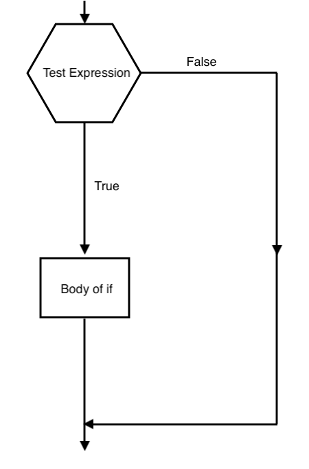
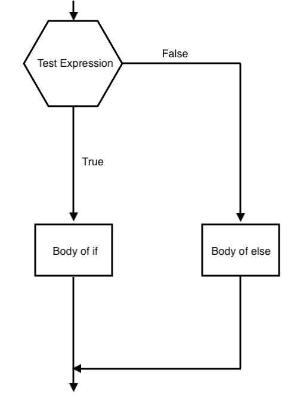
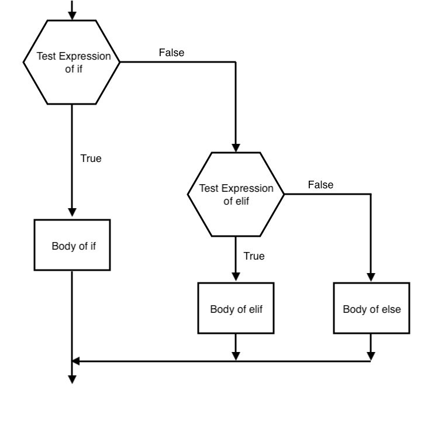

# Introduction to Python

<p align="center" width="100%">
    
</p>

[Python](https://www.python.org/) is an interpreted, object-oriented, high-level programming language.
As opposed to a compiled language like Fortran and C, an interpreted language is a programming language which executes code without the need to previously compile a program into "machine-language".
Since there is no compilation step, the testing and debugging cycle is quite fast.

Python has become one of the most popular programming languages in the world in recent years.
Python's simple, easy to learn syntax emphasizes readability, so it is one of the "easier" languages to learn when beginning to program.
It can be used for machine learning, website development, data science, task automation, and much more.
In high-performance computing, Python is heavily used to analyze scientific data on the system.

The walkthrough presented in this repository is meant to give you experience with some of the basic foundation of the Python language.
There is much more to Python than what is included in this guide, but what is provided will hopefully set you on the right path.
We will specifically be using "Python 3" syntax in this guide (as opposed to "Python 2").
For additional help and topics, be sure to check out the [Additional Resources](#refs) section.

Two of the most common ways to use Python are:

1. Using an interactive session within your terminal
2. Writing/Launching Python scripts (typically ".py" files)

Part one of the walkthrough will be in interactive mode, while part two will be in scripting mode (as what is covered in the part two subsections are better suited in a scripting environment).

Table of Contents:

* The Basics - Part One
	* [Line Syntax](#synt)
	* [Numbers and Variables](#nums)
	* [Strings and Slicing](#strs)
	* [Lists](#lists)
* The Basics - Part Two
	* [Scripts](#scripts)
	* [Loops and Indentation](#loops)
	* [if-elif-else Statements](#ifs)
	* [Functions](#funcs)
* [Closing Remarks](#close)
* [Bonus Challenges](#challs)
* [Additional Resources](#refs)

## The Basics - Part One

Before you start writing your own Python scripts, it is recommended to first test things in an interactive session.
This will allow you to see output in real-time and let you fix things dynamically if error messages arise.
Unless otherwise stated below a specific example, it is encouraged to follow along in your own interactive Python session through this part of the walkthrough.

### <a name="synt"></a>1. Line Syntax

Before getting started, make sure that you have a fresh Unix terminal open.
Once you have a terminal open, change directories to the `intro_to_python` directory:

```
$ cd ~/foundational_hpc_skills/intro_to_python
```

> Note: The above syntax is assuming you stored the `foundational_hpc_skills` repository in your Home directory.

To get started, all you have to do is launch an interactive Python shell by typing "python3" in your terminal:

```python
$ python3

Python 3.7.6 (default, Aug 13 2021, 16:40:31) 
[Clang 12.0.5 (clang-1205.0.22.11)] on darwin
Type "help", "copyright", "credits" or "license" for more information.
>>>
```

> Note: If for some reason you need to quit early in this walkthrough, type `quit()` and then press Enter/Return while in your interactive Python shell

The `>>>` symbol is the prompt of the interactive Python interpreter, meaning that the interpreter is ready for Python code to be typed in.
Anything you type in, until you exit your interactive shell, will be executed with Python.
The code will be executed on a line-by-line basis, and a line will be executed after pressing Enter/Return.
To end a statement in Python, you do not have to type in a semicolon or other special character, you just need to press Enter/Return.

First, let's test things out by making Python say "Hello!" to us using the `print` function:

```
>>> print("Hello!")
Hello!
>>>
```

Congratulations, you just used Python for the first time in this walkthrough!
As it has finished printing out "Hello!", the interactive prompt is now displaying `>>>` again and waiting for you to tell it what to do next.
Let's use the `print` function again to print out multiple things at once that are side-by-side:

```
>>> print("I am on the left!", "I am on the right!")
I am on the left! I am on the right!
>>>
```

Under certain circumstances, your lines may begin with `...` (called "continuation lines"), indicating that the interpreter has not run anything yet and is waiting for you to input something else or "finish" the line.
To see this, we can explicitly span a single Python statement across multiple lines by using the `\` symbol at the end of a line.
Let's do this by modifying our above `print` statement example:

```
>>> print("I am on the left!", \
... "I am on the right!")

I am on the left! I am on the right!
```

Even though we split the single statement across multiple lines, Python still ran the code as if it were all on the same line.
Therefore, you can think of the `\` symbol as just extending any given line.
Using `\` can be helpful if you are typing a lot of code on a single line and would like to make it more "human-readable" in a text editor for example.
The reason why you see `...` is because the interpreter waited for you to tell it what to do next.
In this case, it was waiting for you to "finish" the `print` function by submitting the final closing `)`.

Now that you've seen how to split a single Python statement across multiple lines, let's try to combine multiple statements into a single line.
We can combine both statements into a single line using the `;` symbol.
Consider the following code:

```
>>> print("I am on top") ; print("I am on bottom")
I am on top
I am on bottom
```

The `;` symbol is a shortcut for executing multiple statements on a single line, rather than having to code two lines separately.
This can be useful for consecutive lines that are short and succinct, or for consecutive lines that may be related to each other.
To the Python interpreter, the above example would just look like:

```
>>> print("I am on top")
>>> print("I am on bottom")
```

Some final syntax that we need to cover before moving on is Python "comments".
Comments are not interpreted by Python and are used to clarify code -- usually they act as notes to yourself or others to explain what a piece of code may be doing (they are otherwise hidden).
Comments in Python start with the hash character `#` (also known as "pound" or "hashtag"), which affects all the text you type in afterward.
A comment may appear at the start of a brand new line or following pieces of code.
However, the `#` symbol enclosed by a pair of `"` or `'` is just a hash character and has no effect.
For example, consider the following code:

```
>>> # this is a comment
>>> print("Comments are hidden") # this is also a comment
Comments are hidden
>>> print(" # this is not a comment because enclosed in quotes")
 # this is not a comment because enclosed in quotes
```

Comments are used heavily throughout this guide and, other than the above example, you do not have to type in the comments yourself while you go through the examples -- they are mainly there for you to read.

> Note: As you will see when we discuss scripting (see [Scripts](#scripts) section), you can enclose multiple lines in a pair of `'''` or `"""` (three single quotes or three double quotes) to comment out entire blocks of lines.

Now that we have covered some of the basic syntax, let's dig deeper and show off what Python can do with numbers.

### <a name="nums"></a>2. Numbers and Variables

One of the most common things Python is used for is being a *fancy* numerical calculator.
Python behaves similarly to other languages when performing arithmetic, using the operators `+,-,*,/` for addition, subtraction, multiplication, and division:

```python
>>> 2 + 2        # addition
4
>>> 0 - 1        # subtraction
-1
>>> 2 * 3        # multiplication
6
>>> 10 / 5       # division
2.0
>>> 3 ** 2       # exponents/powers (e.g., 3 to the power of 2)
9
>>> (1 + 2) * 4  # parentheses have priority
12
```

As is the case with most coding languages, integers (-2, -1, 0, 1, etc.) are of the type `int` and rational numbers (-2.0, -1.3, 0.2, 1.4, etc.) are of the type `float`. Mixing `float` and `int` numbers typically results in converting everything to a `float`.
Using the `/` division operator to divide integers also results in a `float`, unless you use the `//` "floor" division operator:

```python
>>> type(1.0) # check type of 1.0
<class 'float'>
>>> type(1)   # check type of 1
<class 'int'>
>>> 4.2 * 2   # mixed inputs results in a float answer
8.4
>>> 17 / 3    # integer division results in a float answer
5.666666666666667
>>> 17 // 3   # integer division with "//" floors the answer to an integer
5
```

You can use the equal sign `=` to assign a value to a variable:

```python
>>> width = 2.0  # storing a value into a variable called "width"
>>> height = 3.0 # storing a value into a variable called "height"
>>> area = width * height
>>> print(area)  # explicitly print out a variable
6.0
>>> area         # prints out a variable (only possible in interactive mode)
6.0
```

A variable name can only contain alpha-numeric characters and underscores (A-Z, 0-9, and _ ) and cannot start with a number.
Additionally, a variable name is also case-sensitive and must be one continuous set of characters without any spaces, or you will get an error.
If you try and access a variable that does not exist, you will also get an error:

```python
>>> print(area)      # print out our old variable
6.0

>>> print(Area)      # slightly misspell our variable (case-sensitive)
Traceback (most recent call last):
  File "<stdin>", line 1, in <module>
NameError: name 'Area' is not defined

>>> width new = 4.0  # try to set a variable name with a space in it
  File "<stdin>", line 1
    width new = 4.0
            ^
SyntaxError: invalid syntax
```

> Note: Soon you will see that variables aren't just limited to numbers, they can store other types of data as well.

For a more advanced approach, here are some handy tricks when using variables:

```python
>>> x, y, z = 1, 2, 3  # set multiple variables at once to different values
>>> print(x,y,z)
1 2 3
>>> a = b = c = 4      # set multiple variables at once to the same value
>>> print(a,b,c)
4 4 4
>>> e = 5
>>> f = 6
>>> print(e,f)
5 6
>>> e, f = f, e        # swap two variables
>>> print(e,f)
6 5
```

One last trick that not many people are taught is that, in interactive mode, the last printed expression is assigned to the internal variable name `_`.
This comes in handy when you are using Python as a quick calculator, for example:

```python
>>> tax = .10      # set tax to ten percent
>>> price = 100.0  # price is $100
>>> tax * price    # additional price, gets assigned to "_" variable
10.0
>>> _              # print out what "_" currently is
10.0
>>> price + _      # total price, also resets "_" variable
110.0
>>> _
110.0
```

This variable should be treated as read-only by the user.
Do **NOT** try to explicitly assign a value to `_`, because you would create an independent local variable with the same name that would override the built-in variable with its "magic" behavior.

Let's continue the Python "magic" by moving on to strings!

### <a name="strs"></a>3. Strings and Slicing

A string in Python is a sequence of characters that usually represent a form of text.
In other coding languages, such as Fortran and C, text is usually stored in some form of "character" or "char" datatype.
Python, however, does not have a character datatype.
Instead, a single character in Python is simply a "string" datatype called `str` with length 1 (a string with two characters would be of length 2, etc.).
Like with numbers, Python also has the ability to manipulate strings.

We have already used a few strings in this walkthrough when we used the `print` function, but you can also assign strings to variables using `=`.
To create a string in Python, all you have to do is enclose it in a pair of quotation marks, either a pair of single quotes `'...'` or double quotes `"..."`.
The choice between the two is usually personal preference; however, `"` is helpful when the string you are dealing with already has a `'` in it, and vice versa:

```python
>>> x = "Hello"                       # double quote example
>>> y = 'Hello'                       # single quote example
>>> x==y                              # check if "x" is equivalent to "y"
True
>>> no_error_1 = "You're cool"        # double quotes enclosing a single quote
>>> error_1 = 'You're cool'           # using single quotes instead (error)

  File "<stdin>", line 1
    error_1 = 'You're cool'
                    ^
SyntaxError: invalid syntax

>>> no_error_2 = ' No "i" in "Team" ' # single quotes enclosing double quotes
>>> error_2 = " No "i" in "Team" "    # using double quotes instead (error)

  File "<stdin>", line 1
    error_2 = " No "i" in "Team" "
                    ^
SyntaxError: invalid syntax
```

For a more advanced approach, you can explicitly "escape" the error messages seen above by using either `\'` or `\"` in problematic areas:

```python
>>> error_1_fix = 'You\'re cool'           # use \ symbol to escape ' (fixes error)
>>> error_2_fix = " No \"i\" in \"Team\" " # use \ symbol to escape " (fixes error) 
```

Similar to numbers, strings also can be manipulated using the `+` and `*` operators.
More specifically, the `+` operator combines two strings, while the `*` operator can be used to repeat a string if used with a number:

```python
>>> "gg" + "ez"              # combining two strings using +
'ggez'
>>> 3 * "yes"                # repeat a string using *
'yesyesyes'
>>> ( 3 * "yes" ) + "no"     # repeat a string and combine
'yesyesyesno'
```

One shortcut that is only usable when dealing with two strings outside of variables is the ability to automatically combine them without having to use the `+` operator:

```python
>>> "Good luck " "have fun"  # combine two literal strings
'Good luck have fun'
>>> x = "Good luck "
>>> y = "have fun"
>>> x y                      # try with variables instead (error)
  File "<stdin>", line 1
    x y
      ^
SyntaxError: invalid syntax

>>> x + y                    # combining string variables must use +
'Good luck have fun'
```

As you will see with lists further below, one cool thing about strings is that you can "slice" them to extract specific portions of the string.
Slicing is heavily used in Python programming, especially when analyzing data, plotting, and sorting.
"Indexing" is a subset of slicing that only extracts one character from a string, while "slicing" can extract multiple characters at once (i.e., multiple indices).

As is the convention with most of Python, indexing starts at 0 instead of 1, which can be confusing at times (especially for those transitioning from Fortran).
The first character in a string has index 0, the second character has index 1, and so on and so forth.
To find the full length of a string you can use the `len` function.
Let's see this in some examples.
To start, you must put these indices in square brackets `[ ]`:

```python
>>> z = "abcdefghij"  # make a test string of length 10
>>> len(z)
10
>>> z[0] # character in index/position 0
'a'
>>> z[1] # character in index/position 1
'b'
>>> z[9] # character in index/position 9
'j'
```

> Warning: We will be using the variable "z" for the next couple examples, so be sure not to overwrite it!

Note that in our example we had 10 letters, but since indexing starts from 0, the final letter in the string is index 9.
You can also use negative indices to start at the end of the string.
Therefore, you can think of using negative indices as reading from "right to left" instead of "left to right":

```python
>>> z[-1]  # character in position -1 (equivalent to position 9)
'j'
>>> z[-2]  # character in position -2 (equivalent to position 8)
'i'
```

Negative indices can be helpful when you don't know how long a string is, but you know that you want specific characters located at the end of the string, however long the string may be.

Transitioning from "indexing" to "slicing", you can use the `:` operator inside of `[ ]` to pick a range of indices (inserted on either side of the `:`).
Note that when using `:`, the left side is *inclusive* while the right side is *exclusive*.
Therefore, for a desired range, this results in a syntax of `[desired start index : desired end index + 1 ]`.
For example, using our `z` string variable of length 10:

```python
>>> z[0:10]       # slices indices 0-9 (the entire string of length 10)
'abcdefghij'
>>> z[0:5]        # slices indices 0-4 (the first five characters)
'abcde'
>>> z[1:5]        # slices indices 1-4
'bcde'
>>> z[1 : (4+1)]  # slices indices 1-4 (same as above, but with math)
'bcde'
```

> Note: When performing math inside of `[ ]` on indices, the numbers must be integers and/or the math should result in an integer.

Instead of explicitly indicating the start/end of a slice with indices, you can choose to leave a side of the `:` blank.
Leaving the left side blank means that you want the slice to begin at the start of the string, while leaving the right side blank means you want the slice to stop at the end of the string.
Therefore, leaving **both** sides blank (i.e., `[ : ]`) indicates that you just want the entire string returned.
Going back to our `z` variable again:

```python
>>> z[:]    # return the entire string
'abcdefghij'
>>> z[2:]   # slice from index 2 to the end of the string
'cdefghij'
>>> z[:8]   # slice from the beginning of the string until index 7
'abcdefgh'
>>> z[:-1]  # slice the entire string ignoring the last character
'abcdefghi'
>>> z[:-2]  # slice the entire string ignoring the last two characters
'abcdefgh'
```

Because of the left side of `:` being included and the right side being excluded, this makes sure that `z[ : index ] + z[ index : ]` is always equal to `z`:

```python
>>> z[:2]
'ab'
>>> z[2:]
'cdefghij'
>>> z[:2] + z[2:]
'abcdefghij'
>>> z[:4] + z[4:]
'abcdefghij'
```

A lot of the techniques we use to manipulate strings are also used for more grand and overarching types of data, which is what we'll be covering next.

### <a name="lists"></a>4. Lists

Now that you know a few of the micro-scale datatypes, the next thing we are going to cover is how to group data -- specifically by using something in Python called a "list".
Lists are defined as a "compound" datatype and are able to group together both numbers and strings, either individually or in a mix.
The data contained in a list are comma separated and enclosed by square brackets.
Here are some examples:

```python
>>> blank_list = []                       # create a "blank" list of length 0
>>> tiny_list = ['hola']                  # create a list of length 1
>>> num_list = [0, 1, 2, 3.0, 4.0]        # create a list of numbers of length 5
>>> str_list = ['hey', 'hi', 'yo']        # create a list of strings of length 3
>>> mixed_list = [1, 7, 'cool', 'groovy'] # create a mixed list of length 4
```

> Warning: We will be using the above lists in the next couple examples, so be sure not to overwrite them!

Lists obey some of the same operations we already covered for strings, such as combining and slicing:

```python
>>> combined_list = num_list + str_list  # combining two lists into a new list
>>> combined_list[:]                     # return/slice entire list
[0, 1, 2, 3.0, 4.0, 'hey', 'hi', 'yo']
>>> combined_list[0]                     # return/slice first entry in list
0
>>> combined_list[-1]                    # return/slice final entry in list
'yo'
>>> combined_list[0:5]                   # return/slice first 5 entries
[0, 1, 2, 3.0, 4.0]
>>> len(combined_list)                   # return length of the list
8
```

Unlike with strings, you can modify a specific entry in a list with slicing/indexing:

```python
>>> squares = [0, 1, 4, 9, 16, 25, 'temp'] # create a list of "squared" values  
>>> squares[6]                             # final entry does not fit pattern
'temp'
>>> squares[6] = 36                        # modify data of the final entry
>>> squares                                # inspect the modified list
[0, 1, 4, 9, 16, 25, 36]
```

This slicing ability can also be used to modify sections of lists, or be used to completely remove sections:

```python
>>> dummy = ['a', 'b', 'c', 1, 2, 3, 'g', 'h', 'i'] # create a new list
>>> dummy[3:6]                                      # identify problem area
[1, 2, 3]
>>> dummy[3:6] = ['D', 'E', 'F']                    # replace problem area
>>> dummy                                           # inspect modified list
['a', 'b', 'c', 'D', 'E', 'F', 'g', 'h', 'i']
>>> dummy[3:6] = []                                 # decide to remove that area
>>> dummy                                           # inspect the list again
['a', 'b', 'c', 'g', 'h', 'i']
>>> dummy[:] = []                                   # remove all entries
>>> dummy
[]
```

As you will see further below, we will be utilizing lists a fair amount later in this walkthrough.

This concludes the first half of the basics walkthrough -- the "interactive shell" portion.
Although what's covered below is also considered part of "the basics," the topics below are better suited in a scripting environment.
Hence, we will be transitioning out of the Python interactive shell into writing and running Python scripts instead.

Recall, to quit interactive mode and return to your terminal, use the `quit()` function:

```python
>>> quit()
```

## The Basics - Part Two

The second half of this walkthrough is done in scripting mode for convenience.
Since you are not following along interactively anymore, there are a handful of pre-made example scripts provided in this repository that we are going to inspect and run.

### <a name="scripts"></a>5. Scripts

Luckily, all of what we covered previously still applies when running Python scripts, but there are a few changes of note.
First, since everything in a `.py` file is assumed to be run with Python, there is no need for the `>>>` symbol to be at the beginning of your lines of code.
Similarly, you will no longer need `...` at the beginning of your lines to indicate continuation lines.
We also gain the ability to comment out multiple lines at once using `'''`, which is a nice bonus.
Everything else we discussed previously goes unchanged, yay!

> Note: Technically, you are able to do `'''` in interactive mode, but it is much more cumbersome, so we did not cover it.

To run Python scripts using Python 3, it's as simple as executing `python3 file.py`, but first we need to create a file.
Although most of the scripts in this section are pre-made, it is a good exercise to make your own first.
A blank template file called `first_script.py` is included in this repository for you to fill out.
By now you will have covered the Vim challenge in the HPC foundations repository ([Intro to Vim](../intro_to_vim)), so you can use VIM or your favorite text editor to open the file `first_script.py`.
For example:

```
$ cd ~/foundational_hpc_skills/intro_to_python
$ vi first_script.py
```

Once you have opened this file, it's time to fill it with some code.
Entering code into a Python file works just like entering it into the interactive shell, just without the `>>>`.
And, just like before, it is executed line-by-line, so to enter a new Python statement or piece of code, just move on to the next line.
A blank line in your file will cause no harm, as it just means you are not trying to execute code on that line.
Blank lines can be useful for spacing out your file and organizing your code.
For testing purposes, let's fill out `first_script.py` with the following code:

```python
# top of the file

'''
Showing off commenting out multiple lines.
Sometimes comments of this nature are used
to provide a description of the file at
the top of the file.
They can span multiple lines when enclosed
by a pair of three single quotes.
'''

print("Hello from your first script!")

# add some numbers
x = 8.675
y = 3.09
z = x + y

# print out some output
print("Jenny has ", z, " apples")
```

After you have filled in your file with code, you can run it by executing the following in your terminal:

```bash
$ python3 first_script.py
```

You should then see the following output displayed in your terminal:

```
Hello from your first script!
Jenny has 11.765 apples
```

If you see the above output, great, you are now prepared to continue this walkthrough.
Now that you know how to launch a Python script, let's cover the remaining topics in "the basics".

> Note: The topics and techniques below can still be used in interactive mode, but are better suited in a scripting environment.

### <a name="loops"></a>6. Loops and Indentation

For this section you need to be in the `loops` directory:

```
$ cd ~/foundational_hpc_skills/intro_to_python/loops
```

One of the most common and fun things to do in Python is to write loops of code.
Loops make Python iterate over a certain section of code (usually over a list or a set of numbers).
There are two main types of loops, the "for" loop and the "while" loop.
Let's discuss the "for" loop first.

The `for` statement in Python iterates over the items of a sequence (like a list, a string, or range of values) in the order that the items appear in the sequence.
The proper syntax for a "for" loop looks like this:

```python
for value in sequence:
    body of the loop
```

The body of a "for" loop is separated from the rest of the code using indentation.
Indentation is Python's way of grouping statements, which is typically done by using either tabs or spaces (I used four spaces).
The use of either tabs or spaces is down to personal preference, but you need to  be consistent or you will get errors in your code.
In actual English, you can think of the line `for value in sequence:` as meaning: "For every value in the sequence, Python will do the following:".

Let's see an explicit loop example in `for_loop_list.py`, where Python loops over a list:

```python
# for_loop_list.py

# create a list to loop over
loop_list = ['cat', 'dog', 'hamster', 'bird']

# use a "for" loop to loop over our list
# print out each entry "i" in "loop_list"
for i in loop_list:
    print(i)
```

The goal in `for_loop_list.py` is to print out each entry of the list in succession.
A list `loop_list` is created first, which acts as the "sequence" in this scenario (the object that is being iterated over).
The variable `i` will act as the value of the item inside the sequence on each iteration -- in this case, each entry in `loop_list`.
The loop will first start at "cat" then move on to "dog", "hamster", and "bird" in succession.
Upon each iteration, a `print(i)` statement is called that prints out whatever value `i` happens to be at the time.

Running `for_loop_list.py` let's you see the output of the loop:

```
$ python3 for_loop_list.py
cat
dog
hamster
bird
```

This type of loop can also be used to iterate over a range of values, which is extremely helpful for indexing and slicing in a loop.
To iterate over a range of values, you can use the `range` function, which takes a start value, a stop value, and an optional step value: `range(start, stop, step)`.
Just like with indexing, the start value is inclusive while the stop value is exclusive.

To see some examples, let's inspect the script `for_loop_range.py`:

```python
# for_loop_range.py


# iterate from 0 through 10 (exclude 10) in steps of 1
print( 'Example 6.1: range(0,10,1)' )

for i in range(0,10,1):
    print(i)


# iterate from 0 through 10 (exclude 10) in steps of 2
print(' ')
print( 'Example 6.2: range(0,10,2)' )

for i in range(0,10,2):
    print(i)


# if only supplying one number, it will iterate up to that number
print(' ')
print( 'Example 6.3: range(4)' )

for i in range(4):
    print(i)
    

# iterate over a list using its length and indexing
print(' ')
print( 'Example 6.4: range(length_x)' )

x = ['O','L','C','F']
length_x = len(x)
for i in range(length_x):
    print(x[i])
```

Running `for_loop_range.py` will show you the output:

```
$ python3 for_loop_range.py 
Example 6.1: range(0,10,1)
0
1
2
3
4
5
6
7
8
9
 
Example 6.2: range(0,10,2)
0
2
4
6
8
 
Example 6.3: range(4)
0
1
2
3
 
Example 6.4: range(length_x)
O
L
C
F
```

The second type of loop is called a "while" loop, which keeps iterating until a certain condition is no longer true.
The syntax is a bit simpler with the "while" loop:

```python
while condition:
    body of the loop
```

In actual English, you can think of the line `while condition:` as meaning: "While this condition is true, Python will do the following:".

Because the "while" loop constantly checks to see if a certain statement is "true", the loop is typically used with comparison operators.
The standard comparison operators are: `<` (less than), `>` (greater than), `==` (equal to), `<=` (less than or equal to), `>=` (greater than or equal to) and `!=` (not equal to).

To see some examples, let's inspect the script `while_loops.py`:

```python
# while_loops.py


# iterate only while "a" is less than "b"
print('Example 6.5: while a<b')

a = 0 
b = 5 
while a<b:
    print('a equals', a)
    a = a + 1 

# iterate until "c" equals 6
print(' ')
print('Example 6.6: while c!=6')

c = 0 
while c!=6:
    print("Am I 6 yet?", "Nope, I am", c)
    c = c + 1 
```

Running `while_loops.py` will show you the output:

```
$ python3 while_loops.py
Example 6.5: while a<b
a equals 0
a equals 1
a equals 2
a equals 3
a equals 4
 
Example 6.6: while c!=6
Am I 6 yet? Nope, I am 0
Am I 6 yet? Nope, I am 1
Am I 6 yet? Nope, I am 2
Am I 6 yet? Nope, I am 3
Am I 6 yet? Nope, I am 4
Am I 6 yet? Nope, I am 5
```

"While" loops can be dangerous at times, as it is very easy to accidentally get stuck in an infinite loop if it is not coded properly.
In the above examples, if we did not modify either `a` or `c` in our loops, their value never would have changed and we would have gotten stuck in the loop (as both conditions would always remain true).
In general, if you can convert a "while" loop into a "for" loop, it is recommended to use the "for" loop version instead.

> Note: If you do get stuck in a loop, either close the the terminal window, or press `CTRL+C` to interrupt the execution.

Now that we've introduced conditions being either "True" or "False" in the context of loops, the next natural step is to introduce how to section off your code based on "True" or "False" conditions.

### <a name="ifs"></a>7. if-elif-else Statements

For this section you need to be in the `if_elif_else` directory:

```
$ cd ~/foundational_hpc_skills/intro_to_python/if_elif_else
```

If you want to execute a piece of code only if a specific condition is met, the `if` statement comes in handy.
For example, maybe you only want to print something out if a specific variable is "True", or when a math expression yields a specific value.
No matter the reason, the syntax of the `if` statement is:

```python
if condition:
    body of if statement
```

<p align="center" width="100%">
    
</p>

As you can see, just like with loops, the body of an `if` statement is indented.
In the example above, Python first evaluates `condition` to determine whether it is "True" or "False".
Next, Python executes the body of the statement only if `condition` is "True".
In actual English, you can think of the line `if condition:` as meaning: "If this line is True, Python will do the following:".

Let's see two simple `if` statement examples in `if.py`:

```python
# if.py

# initialize a variable "x"
x = 1 

# Example 7.1: check to see if "x" is equal to 1
if x==1 :
    print('x is 1')

# Example 7.2: check to see if "x" is equal to 2
if x==2 :
    print('x is 2')
```

Before we discuss what happens, let's run `if.py`:

```
$ python3 if.py 
x is 1
```

Recall from [Loops and Indentation](#loops) that the `==` operator checks if two things are equal.
In Example 7.1, `x` did indeed equal 1, so the condition was "True" and Python executed the `print` function in the first `if` statement.
In Example 7.2, `x` did **NOT** equal 2, so the condition was "False" and Python did not execute the `if` statement.
Because we did not tell Python what to do if the condition was "False", Python did nothing and skipped over it.

To explicitly tell Python what to do in the event that the condition is "False", you need to add an `else` statement:

```python
if condition:
    body of if statement     # Do this if the condition is True
else:
    body of else statement   # Do this if the condition is False
```

<p align="center" width="100%">
    
</p>

First, Python checks to see if the condition is "True".
If the condition is "True", then Python executes the body of the `if` statement and ignores the body of the `else` statement.
However, if Python found that the condition was "False", it would execute the body of the `else` statement instead.

> Note: For more advanced users, instead of using an `else` statement for "False" conditions, you could also use the `not` operator and play around with statements like `if not condition:`

Let's see a simple `else` statement example in `else.py`:

```python
# else.py

# initialize a variable "x"
x = 2 

# check to see if "x" is equal to 1, else do something different
if x==1 :
    print('x is 1')
else:
    print('x is not 1')
```

This time, we explicitly told Python to output something if the first statement was not "True".
To see the output, run `else.py`:

```
$ python3 else.py
x is not 1
```

We see that Python only executed one of the print statements because of our `if` and `else` statements.
The `x` variable was equal to 2, so the `if x==1` condition was "False" and Python executed the `else` statement instead.

Extending things further, perhaps you want to tell Python to check for multiple conditions, instead of just one.
In that case, you need to add an `elif` statement (short for "else-if"):

```python
if condition_one:
    body of if statement    # Do this if condition_one is True
elif condition_two:
    body of elif statement  # Do this if condition_two is True
else:
    body of else statement  # Do this if both conditions are False
```

<p align="center" width="100%">
    
</p>

First, Python checks to see if `condition_one` is "True".
If it finds that `condition_one` is "True", then Python will execute the body of the `if` statement and skip the rest (regardless of the remaining conditions).
However, if it finds that `condition_one` is "False", then Python then checks to see if `condition_two` is "True".
If it finds that `condition_two` is "True", then Python will execute the body of the `elif` statement and skip the rest.
And, if all conditions are "False", then Python will execute the `else` statement as a last resort.

Because Python skips the remaining `if-elif-else` code once it finds a "True" condition, only **ONE** of the statements will be executed across an entire `if-elif-else` section of code.
Even if multiple statements are "True", it will only execute whichever one it finds first, starting from the top.

We only used one `elif` line in the above syntax example, but you can include as many `elif` statements as you like.
However, note that you can only ever have one `if` and `else` line in a given `if-elif-else` block of code.

Let's see a simple `elif` statement example in `elif.py`:

```python
# elif.py

# initialize a variable "x"
x = 1 

# check to see if "x" is less than 1, 2, or 3
if x<1 :
    print('x is less than 1')
elif x<2 :
    print('x is less than 2')
elif x<3 :
    print('x is less than 3')
else:
    print('x is not less than 1, 2, or 3')
```

This time we are using the `<` operator to check if `x` is less than a certain number.
Python first checks if `x` is less than 1, then checks if it is less than 2, and finally checks if it is less than 3 before giving up.
`x` is equal to 1, so it actually satisfies both of the `x<2` and `x<3` `elif` statements.
However, because Python checks from top to bottom and executes the first "True" statement it finds first, only the first `elif x<2` statement was executed.

To see this explicitly, run `elif.py`:

```
$ python3 elif.py
x is less than 2
```

Code like that can be tricky to wrap your head around, but the technique can be useful for narrowing in on specific values of numbers, for example.

We are now approaching the final foundation block in Python coding -- functions.

### <a name="funcs"></a>8. Functions

For this section you need to be in the `functions` directory:

```
$ cd ~/foundational_hpc_skills/intro_to_python/functions
```

So far we have covered writing sections of Python code that we did not have to re-use or need more than once.
But what if you want to re-use code without copy pasting or typing it over and over and duplicating code; this is where functions come in to play.

A function is a block of code that only runs when it is called, but is designed to be reusable.
This is a major convenience when trying to repeat a specific action within your code.
We already used a couple pre-defined functions in this walkthrough, mainly `print` and `len`, but you can also create your *own* functions.
These functions are called "user-defined functions".

The structure and syntax of a function looks like this:

```python
def function_name( parameters ):
    '''a description of the function'''
    
    body of the function
    
    return function_results
```

A function is one of the more complex blocks of code described in this walkthrough, so let's break down the structure:

* The function block begins with the `def` keyword followed by the desired name of the function with a set of parentheses `( )`. 
* Any input parameters for the function are placed inside the parentheses next to the function name.

You can think of the bullet points above as: "I want to define a function called `function_name` that depends on these `(parameters)`".

Just like with loops and if-statements, everything within a function block is indented.
Breaking down the indented section:

* A description of the function enclosed by a set of triple-quotes `'''` can be included at the top. This is optional but a good habit.
* The "body" of the function is the code you want the function to perform when called, similar to the body of a loop or if-statement.
* The `return` statement exits the function, and can pass back a specific variable or expression, usually the results of the body.

You can think of the bullet points above as: "When called, I want the function to execute the body and return `function_results` when it exits".

Combining everything, you can think of coding a function as: "I want to define a function called `function_name` that depends on these `(parameters)`. When called, I want the function to execute the body and return `function_results` when it exits".

Once a function is defined, you are then able to "call" it (execute it). 
An example function is included in the script `func_print.py`:

```python
# func_print.py

# define the function
def sum_print(x,y):
    '''This function will sum
       x and y into a variable
       z and print z when the 
       function exits'''

    z = x + y        # the "body" that the function executes

    return print(z)  # what is done on function exit

# execute the function with x=3 and y=5
sum_print(x=3,y=5)
```

> Note: It is good practice to define your functions at the top of the script, so they are easily findable. Doing so also makes your code flow better and makes it more readable than placing a function block in the middle of your script, for example.

As the description in the function says, the user-defined function `sum_print` will sum `x` and `y` and then return `print(z)` when the function ends.
In this case, we call `sum_print` with the parameters `x=3` and `y=5`, so `z` will be equal to 8.

To see the output, run `func_print.py`:

```
$ python3 func_print.py
8
```

Because we told the function to `return print(z)` when the function call completed, we were actually able to see the output "8".
Instead, we could have told the function to `return z` when it finished, which would return the ***variable*** `z` rather than printing the actual ***value*** of `z`.
You can see this in the script `func_var.py`:

```python
# func_var.py

def sum_var(x,y):
    '''This function will sum
       x and y into a variable
       z and return the variable z
       when the function exits'''

    z = x + y 

    return z

# Example 8.1: execute the function without saving the result
sum_var(3,5)

# Example 8.2: execute the function while saving result to a variable
test = sum_var(3,5)
print(test)
```

The function `sum_var` was written exactly like the previously discussed `sum_print` function, but with the key difference being `return z` instead of `return print(z)`.
Because of this, calling the function `sum_var` by itself doesn't automatically print out the value of `z` -- as seen in "Example 8.1" in the above script.
This is because that the function was told only to return a variable upon exit, not actually use the variable in a specific way.

In "Example 8.2", we save the resulting variable of the function to a new variable called `test`.
This allows Python to access the `z` result of the function through `test`, which - upon printing - we see that the result of the function is 8, just like before.

```
$ python3 func_var.py
8
```

Saving a function's result to a variable is helpful for when you may need the result at a later time in your code.

> Note: Alternatively, you could do `print( sum_var(3,5) )` to accomplish the same task in "Example 8.2" without having to set a new variable.

## <a name="close"></a>Closing Remarks

It was a long and bumpy ride (especially those last two sections), but you finally reached the end of the walkthrough.
Congratulations!
We did not cover everything there is to know about Python (there is a lot!), but you should now have some basic foundation in Python programming.
One of my favorite topics we did not cover is "user input", where Python prompts the user to type in things as the code is running -- this can be used to quickly test different values for the same variable in a program, for instance, without having to manually change the code in the program itself.
A short tutorial covering this functionality can be found here: [GeeksforGeeks Tutorial](https://www.geeksforgeeks.org/python-3-input-function/).

An additional topic we did not cover that is extremely useful is how to include or embed a variable's data into a string (i.e., how to "format" a string to include a desired variable).
We covered how to print a string and a variable, but not how to include the variable in the string itself.
There are a few options to accomplish this (including something called "f-strings" which is getting popular), and a good summary of some of the options available to you can be found in this [RealPython Tutorial](https://realpython.com/python-f-strings/).

This concludes all that you need to know before attempting the bonus challenges below.
Don't be afraid to ask questions for anything covered in this guide -- we are here to help!

## <a name="challs"></a>Bonus Challenges

To access the challenges, you must change directories to the `challenges` directory:

```
$ cd ~/foundational_hpc_skills/intro_to_python/challenges
```

> Note: The above syntax is assuming you stored the `foundational_hpc_skills` repository in your Home directory.

If you are having trouble completing the challenges, potential solutions are provided in the `solutions` sub-directory.

```
$ cd ~/foundational_hpc_skills/intro_to_python/challenges/solutions
```

Although the above walkthrough was the main "challenge", the bonus challenges provide some more hands-on experience with the topics that we covered above.
These challenges are Python scripts that are missing lines of code that you must fill in to make the script work (marked by sections of code labeled as "TO-DO").
Hints are provided at the top of each script that guide you toward the provided solution; however, there can be multiple ways to solve a challenge.

A list of the bonus challenges resides below, along with a brief description of the goal for each challenge.
Challenges are listed by difficulty, with the first challenge being the "easiest" and the last challenge being the "hardest" (experience may vary).

* "Slicing the cake" `cake.py` [Easy]:

    **Relevant sections:** [Lists](#lists)
    
    Who doesn't love slicing some cake?
    The objective of this challenge is to match two lists (`test_cake` and `fake_cake`) by slicing `real_cake`.
    Your mission is to edit the line labeled as "TO-DO" to get the script to work properly.
    After editing the script, run it to see if you correctly fixed things.
    If you are successful, you will see `Success!` printed out.
    
    A preview of `cake.py`:

	```python
	# cake.py
	
	# Set up lists
	real_cake = ['portal', 'the cake', 'is', 'not', 'a lie', '!', 'hl3']
	fake_cake = ['the cake', 'is', 'a lie', '!']
	
	# Manipulate real_cake to match fake_cake
	test_cake = real_cake[] + real_cake[] #TO-DO
	
	# Check to see if you are correct
	print('real cake:', real_cake)
	print('fake cake:', fake_cake)
	print('test cake:', test_cake)
	
	if test_cake == fake_cake:
	    print('Success!')
	else:
	    print('Try again!')
	    print('Fake cake should equal test cake')
	```

* "Calculating the box" `box.py` [Easy]:

    **Relevant sections:** [Numbers and Variables](#nums), [Lists](#lists), [Functions](#funcs)
    
    Who doesn't love math and boxes?
    The objective of this challenge is to fill in the missing information of the  `get_size` function to calculate the area and volume of a box and then return the results in the form of a list `[area, volume]`.
    You will need to edit both the body of the function and the `return` line of the function, which are both marked by "TO-DO" comments.
    After editing the script, run it to see if you correctly fixed things.
    If you are successful, you will see `Success!` printed out.
    
    A preview of `box.py`:

	```python
	# box.py
	
	# Hint: area = 2*depth*width + 2*depth*height + 2*width*height
	# Hint: volume = width*height*depth
	
	def get_size(w,h,d):
	    '''This function calculates the
	    surface area and volume of any
	    given box of width "w", height
	    "h", and depth "d".'''
	
	    #TO-DO
	
	    return #TO-DO
	
	# Test the get_size function for a couple box sizes
	box_1 = get_size(w=1, h=1, d=1)
	box_2 = get_size(w=4, h=2, d=6)
	
	# Check to see if you are correct
	print('Area and volume of 1x1x1 box: ', box_1)
	print('Area and volume of 4x2x6 box: ', box_2)
	
	if (box_1 == [6,1]) and (box_2 == [88,48]):
	    print('Success!')
	else:
	    print('Try again!')
	    print('You should get [6,1] and [88,48]')
	```

* "Playing the banjo" `banjo.py` [Medium]:

    **Relevant sections:** [Strings](#strs), [if-elif-else Statements](#ifs), [Functions](#funcs)
    
    Who doesn't love the banjo?
    The objective of this challenge is to fill in the missing information of the  `playing_banjo` function to figure out if someone knows how to play the banjo or not.
    More specifically, you want the function to `print` either `NAME plays the banjo` or `NAME does not play the banjo` based on a person's name.
    In this code-world, only names that begin with the letter "R" (lower case or upper case) know how to play the banjo.
    You will need to edit the `if` and `elif` statements in the body of the function to make sure things print out correctly (marked by the "TO-DO" comments).
    Note that the `else` statement is already correctly filled in.
    After editing the script, run it to see if you correctly fixed things.
    If you are successful, you will see this output:
    
    ```
    Leah does not play the banjo
	michael does not play the banjo
	brian does not play the banjo
	Ryan plays the banjo
	rolf plays the banjo
    ```
    
    A preview of `banjo.py`:

	```python
	# banjo.py
	
	# Hint: Remember, you can slice strings to extract specific letters!
	
	def playing_banjo(name):
	    '''This function checks to see if someone plays
	    the banjo based on their name. Names beginning
	    with "R" or "r" play the banjo, while others do not.'''
	
	    if :   #TO-DO
	
	    elif : #TO-DO
	
	    else:
	        banjo = name + " does not play the banjo"
	    return print(banjo)
	
	# Test cases to see if you are correct
	playing_banjo('Leah')
	playing_banjo('michael')
	playing_banjo('brian')
	playing_banjo('Ryan')
	playing_banjo('rolf')
	```

* "Counting the sheep" `sheep.py` [Medium]:

    **Relevant sections:** [Lists](#lists), [Loops](#loops), [Functions](#funcs)
    
    Who doesn't love sheep?
    The objective of this challenge is to fill in the missing information of the  `count_sheeps` function to count the number of "True" entries in a list.
    Each "True" entry in the list represents one single sheep in this universe.
    You will only need to edit one line of the body of the function, marked by the "TO-DO" comment.
    After editing the script, run it to see if you correctly fixed things (the function should be able to detect 17 sheep).
    If you are successful, you will see `Success!` printed out.
    
    A preview of `sheep.py`:

	```python
	# sheep.py
	
	# Hint: In Python, "True" equals 1 and "False" equals 0
	# Hint: You will need to use indexing
	
	def count_sheeps(sheep):
	    '''This function loops over the entire sheep
	    array and adds up all the values'''
	
	    size_sheep = len(sheep)
	    count = 0 
	    for i in range(0, size_sheep):
	        count = # TO-DO
	
	    return count
	
	# Our flock of "sheep" list
	flock = [True,  True,  True,  False, \
	          True,  True,  True,  True , \ 
	          True,  False, True,  False, \
	          True,  False, False, True , \ 
	          True,  True,  True,  True , \ 
	          False, False, True,  True ]
	
	# Call the count_sheeps function
	flock_count = count_sheeps(flock)
	
	# Check to see if you are correct
	print("You counted this many sheep: ", flock_count)
	
	if flock_count == 17: 
	    print("There are 17 sheep! Success!")
	else:
	    print("Try again!")
	    print("The sheep count should be 17")
	```

* "Finding the needle" `needle.py` [Hard]:

    **Relevant sections:** [Loops](#loops), [if-elif-else Statements](#ifs), [Functions](#funcs)
    
    Who doesn't love needles in haystacks?
    The objective of this challenge is to fill in the missing information of the  `find_needle` function so that it returns the position of "needle" in a given list.
    You will need to edit the body of the loop in the function and the `return` line of the function (both marked by "TO-DO" comments).
    Note that you will need to add more than one line in the body of the loop even though it's only marked by one "TO-DO" comment.
    After editing the script, run it to see if you correctly fixed things.
    If you are successful, you will see `Success!` printed out.
    
    A preview of `needle.py`:

	```python
	# needle.py
	
	# Hint: Use dummy_index to track iterations of the loop
	
	def find_needle(haystack):
	    '''This function iterates through a list
	    to find the "needle" string. The function
	    then returns the index (position) in the
	    list where it found "needle".'''
	
	    dummy_index = 0 
	    for entry in haystack:
	        #TO-DO
	
	    return #TO-DO
	
	# Create a couple "haystack" lists to be searched through and tested
	hay_list_1 = ['283497238987234', 'a dog', 'a cat',     \   
	                 'some random junk', 'a piece of hay', \
	                 'needle', 'something somebody lost a while ago']
	
	hay_list_2 = ['Python is cooler than C++', 'needle',    \   
	              'Fortran is also cool', 'blah', 'summit', \
	              'rhea', 'andes', 'titan']
	
	# Call the find_needle function, set result to a variable
	needle_pos_1 = find_needle(hay_list_1)
	needle_pos_2 = find_needle(hay_list_2)
	
	# Check to see if you are correct
	print('Found the needle in the 1st haystack at position', needle_pos_1)
	print('Found the needle in the 2nd haystack at position', needle_pos_2)
	
	if (needle_pos_1 == 5) and (needle_pos_2 == 1): 
	    print('Success!')
	else:
	    print('Try again!')
	    print('You should find them at position 5 and position 1')
	```
   
 
   
## <a name="refs"></a>Additional Resources

* [Python Website](https://www.python.org/)
* [Python Documentation](https://docs.python.org/3/)
* [Python Tutorial](https://docs.python.org/3/tutorial/introduction.html)
* [Including Variables in Strings](https://realpython.com/python-f-strings/)
* [User Input Tutorial](https://www.geeksforgeeks.org/python-3-input-function/)
